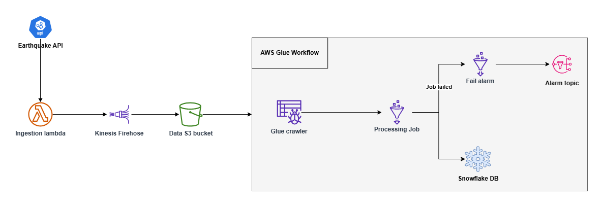

# earthquake-processing-dp

This project implements a **Terraform-managed data pipeline** for ingesting earthquake data from a public API, validating it, storing it in S3, processing it using AWS Glue, and loading it into Snowflake for further analysis. The goal is to demonstrate best practices with Terraform, serverless architecture, and data engineering workflows.

---

## 🔧 Tech Stack

- **Terraform** – Infrastructure as Code
- **AWS Lambda** – API ingestion and validation
- **Amazon Kinesis Firehose** – Streaming to S3
- **AWS S3** – Data lake storage
- **AWS Glue** – Crawling, transforming and processing
- **Snowflake** – Data warehousing and analytics

## 📌 Architecture Overview

1. **API Ingestion Lambda**
   - Triggered every **1 hour**.
   - Fetches earthquake data from an external API.
   - Validates the data format and schema.
   - Sends the data to **Kinesis Data Firehose** which delivers the data into an **S3 bucket** under the prefix `earthquake_data/`.

2. **Glue Workflow**
   - Triggered every **1 hour** after the API Ingestion Lambda is finished.
   - The workflow consists of:
     - A **Glue Crawler** to catalog new files and infer schema.
     - A **Glue Job** that transforms and enriches the data:
       - Applies any necessary filtering, cleaning, or enrichment.
       - Load the final schema into Snowflake.

## Deploying

This project is using ci-cd process so the changes are automatically deployed. Upon merging to the `development` branch in github, the code will be deployed to dev environment. When merged to `main` branch, the code will be deployed to all other enviroments. 

Also, parts of the project can be deployed manually using `infractl.sh` scripts

